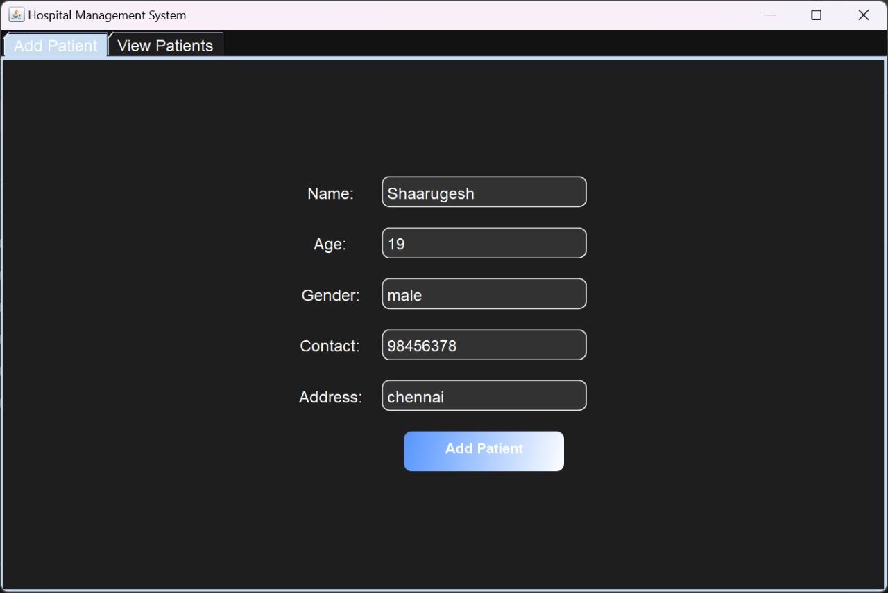
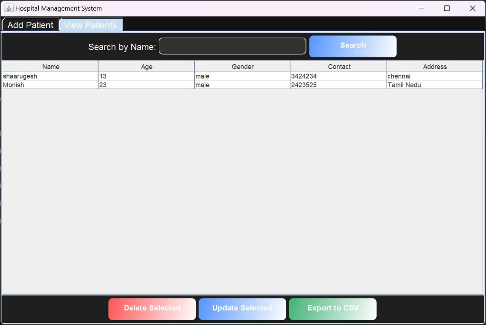
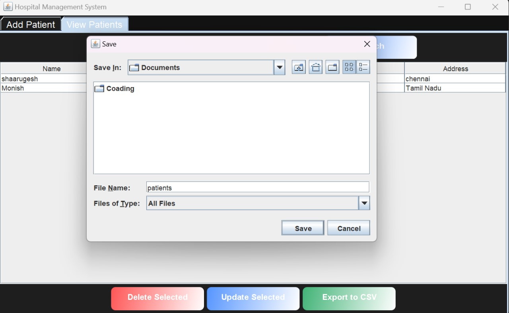
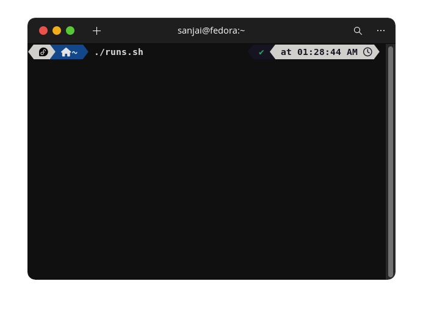

# Hospital Management System

### Aim
The **Hospital Management System** is designed to streamline patient management in hospitals by providing a modern, user-friendly interface. This application is built using Java Swing, featuring a dark theme, rounded corner input fields, and intuitive navigation for efficient hospital operations. It allows hospital staff to add, update, view, and delete patient records, while providing a smooth search and data export experience.

### Key Features
- **Modern UI Design**: Dark theme with a minimalist layout and rounded corner input fields for a sleek, contemporary look.
- **Add Patient**: A form with fields such as Name, Age, Gender, Contact, and Address, allowing users to easily add patient details.
- **View Patients**: A table of patient records with options to search, sort, and delete entries.
- **Search Functionality**: A responsive search bar for filtering patients by name.
- **Update Patient Records**: Editable fields in patient records, with prompts to update specific information.
- **Delete Patient Records**: The ability to remove a patient from the system with a single click.
- **Export to CSV**: Export patient data to a CSV file for external use or backup.
- **Responsive Buttons**: Rounded, gradient-styled buttons that improve user experience and visual appeal.
- **File-Based Data Storage**: Patient data is persistently stored in a local file, ensuring availability even after restarting the application.

### Screenshots










- **Add Patient Panel**: A modern form with all essential patient details.
- **View Patients Panel**: An interactive table displaying patient data with search and action buttons.

## Run the App
To run run the app in your system
***For Windows **
```` sh run.sh````
or 
```./run.sh```


***For mac/linux***
```./run.sh```




### Technologies Used
- **Java Swing** for building the user interface.
- **Custom Borders** for rounded input fields and buttons.
- **File I/O** for persistent data storage (patients saved in a local file).
- **JTable** for managing and displaying tabular data.

---

# Java-App
